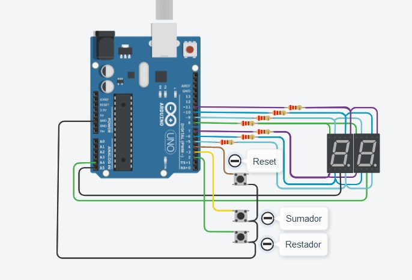
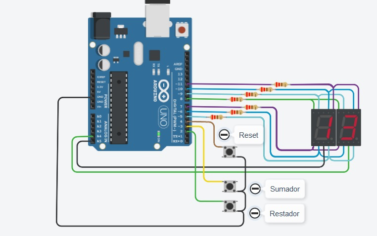
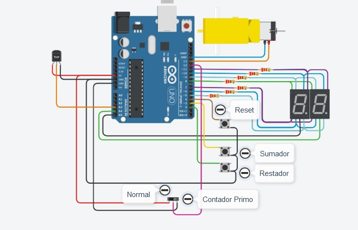
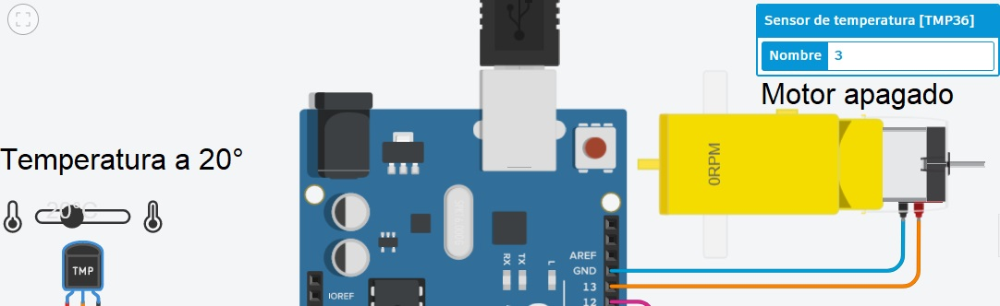
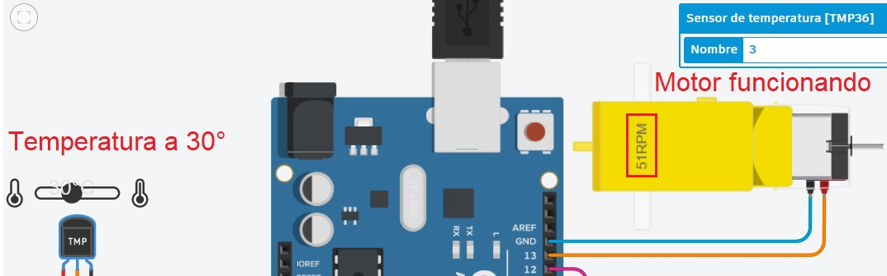
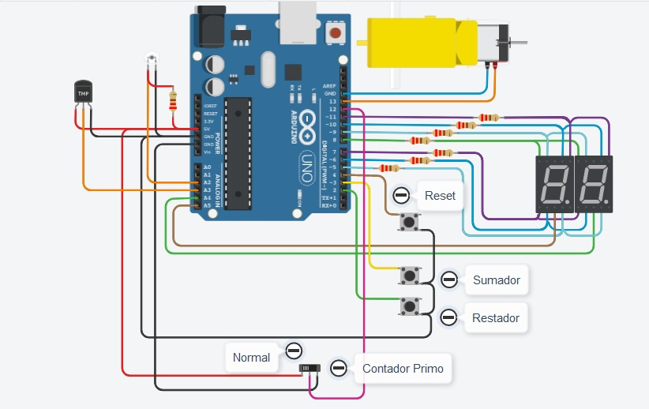

# 1° Parcial SPD, Division-J

**_El siguiente proyecto consiste en tres partes, las cuales se detallaran a continuacion:_**

## _1° Parte: Contador de 0 a 99 con Display 7 Segmentos y Multiplexación_

La primera parte del proyecyto consistira en conectar dos display de 7 segmentos (uno para marcar unidad y otra para decenas) y tres botones (sumador, restador y reset) a un Arduino y programarlo de forma tal que en base a multiplexacion se puedan observar ambos displays al mismo tiempo e independientes el uno del otro.

Primero, el esquema de las conexiones de nuestro proyecto:

_Los leds de cada display se conectan a las entradas digitales del Arduino (5 a 11 inclusive). Los catodos comunes a entradas analogicas (A4 para la unidad y A5 para la decena). Y los botones a entradas digitales (2 para el restador, 3 para el sumador y 4 para el reset) y a tierra._

# **Codigo 1**

Primero se definiran los componentes. Los leds de los displays, el valor APAGADOS (que se utiliza para apagar todos los leds), los 3 botones, las entradas analogicas de cada display (visualizador 1 y 2) y el tiempo de display entre los displays (TIMEDISPLAYON).

Se procede a definir variables:

_int sube =1;_ (Si se presiona el boton de suma)

_int subePrevia = 1;_ (Si se ha presionado anteriormente el boton de suma)

_int baja = 1;_ (Si se presiona el boton de resta)

_int bajaPrevia = 1;_ (Si se ha presionado anteriormente el boton de resta)

_int reset = 1;_ (Si se presiona el boton de reseteo)

_int resetPrevia = 1;_ (Si se ha presionado anteriormente el boton de reseteo)

_int countDigit = 0;_ (El valor del contador que se mostrara en los displays)

En Setup se comienza con un for que iterara de 5 a 11 (los pines digitales de los leds) y luego aplicara el valor del indice 'i' en la funcion "configurarLed" (se explicara mas adelante en la seccion funciones). Luego se definen los pinMode para los botones (input_pullup, entradas), los visualizadores (output, salida) y la escritura digital de los visualizadores (comienza en LOW). Se define tambien el serial para poder utilizarlo en caso de que se necesiten hacer pruebas y revisar valores en el monitor en serie.

Funciones:
Las funciones utilizadas son las siguientes
* configurarLed:
Se utiliza para poder definir como salida a todos los pines digitales de los leds, iterando en el setup (como se menciono anteriormente) para manejar menos lineas de codigo repetitivo. Toma como parametro el led (pin) a definir y su estado (entrada o salida).

* ConfigurarDisplay:
Esta funcion se usa para definir que leds en el display se encienden, realizando un digitalWrite para cada led dentro de la funcion. Tomara 1 o 0 7 veces como parametros para definifinir que leds desea que se encienda o no para formar el digito buscado.

* dibujarNumero:
La funcion dibujar numero se encarga de definir las 10 combinaciones posibles entre los leds para formar el numero en el display. Toma como parametros el valor de 1 o 0 para cada led y el numero que desea dibujar.
Se realiza un switch tomando como variable el parametro numero y luego se define en cada caso posible (del 0 al 9) la combinacion de leds a encender y apagar con la funcion configurarDisplay ya explicada.
En cada caso debe hacerse un _break_ para que el numero se mantenga dibujado.

* prendeDigito:
Esta funcion se encarga de definir que display debera verse y cual apagarse, de forma tal que puedan, en conjunto con las demas funciones, dibujar dos digitos independientes para la unidad y la decena. La funcion toma como parametro simplemente el visualizador que debe observarse (definido como digito) y lo ejecuta mediante digitalWrite. Si "digito" corresponde al VISUALIZADOR_1, este se apagara y se encendera el VISUALIZADOR_2. Si fuera lo opuesto, se encendera el 1 y apagara el 2. Caso contrario ambos estaran encendidos.

* printCount:
La funcion printCount combinara las funciones anteriormente definidas y tomara como parametro solamente "count", que se correspondera con el numero que desea mostrarse.
Se usa la funcion prendeDigito y se da como parametro "APAGADOS", para que ambos display comienzen apagados. Luego se da un delay de 10 milisegundos (el valor definido de TIMEDISPLAYON). A continuacion se invoca a la funcion dibujarNumero dandole como parametros cada led y el valor usado para la decena ("count" dividido 10).
Despues se llama a la funcion prendeDigito, dandole como parametro el visualizador de la decena. Se repite el delay anterior y se vuelven a apagar ambos displays.
A continuación se volvera a llamar a la funcion dibujarNumero, esta vez dando como parametro del numero  _count - 10 * (int)count / 10_, que representara a la unidad.
Se usa el prendedigito nuevamente, esta vez dando como parametro el visualizador correspondiente a la unidad y se agrega el mismo delay.
De esta manera se lograra la multiplexacion en ambos digitos al alternarse ambos por solo 10 milisegundos al repetirse constantemente el "loop"

* keypressed:
Esta es la funcion encargada de determinar que boton se oprime y devolver aproiadamente el estado del mismo.
se define como sube, baja y reset al digitalWrite de cada boton respectivamente. Lo primero sera definir las "previas". Si un boton se oprime (digitalWrite = 1) entonces la previa de ese boton tmb se volvera 1 (ej. if(sube == 1) -> subePrevia = 1). Luego se crea un condicional para cada boton, en donde se comprobara si el "valor" del boton es 0 y si es diferente al de su previa. De serlo, la previa tomara el valor del actual (0) y devolvera el valor del boton.
De esta manera, se logra que el toque del boton sea preciso y no de multiples lecturas al presionarlo por "demasiado" tiempo.

El loop del codigo consistira entonces de la aplicacion de la funcion keypressed (a la cual se denominara "pressed"). Si la misma es "SUBE" se suma el contador (countDigit) en uno. Si es "BAJA" se resta en uno y si es RESET lo vuelve 0. Se crean las condicionales para asegurarse que el rango se mantenga entre 00 y 99 y luego se aplica el valor del contador como parametro a la funcion printCount que mostrara el resultado.

## _2° Parte: Modificación con Interruptor Deslizante y Números Primos + motor y sensor:_

La siguiente parte consistira en tomar lo realizado en la primera parte y agregar un switch que hara que el contador funcione como en la primera parte o bien que muestre solo los numeros primos.

Tambien debera agregarle un motor a eleccion (de CC o aficionado) y un tipo de sensor (temepratura, fuerza o flexion) para incorporar al proyecto.

Primero realizamos el esquema del nuevo proyecto. En este caso se utilizo el motor de aficionado y un sensor de tempertatura para incorporar.

Los nuevos componentes se conectan de la siguiente manera:

El switch conectara su terminal 1 y 2 a alimentacion (5V) y a tierra respectivamente. El común se conectara al pin digital numero 12.

El motor se conecta al pin digital numero 13 y a tierra.

El sensor se conecta a potencia y tierra y el "vout" al pin analogico numero 3.

# **Codigo 2**

Ahora se debera actualizar el codigo anterior. Se agregan las definiciones del motor, el sensor y el switch:

#define MOTOR 13
#define SENSOR A3
...
#define SW_1 12

En _setup_, definimos al motor como un output (pinMode(MOTOR, OUTPUT);)

Las nuevas adiciones al codigo se realizaran todas en el Loop. Primero, definimos el valor de lectura del sensor (int valorsensor = analogRead(SENSOR);). Creamos la variable entera "temp" (int temp;) y luego realizaremos el mapeado en la misma con los parametros del sensor (temp = map (valorsensor, 20, 358, -40, 125);).

El primer valor en la funcion map es el valor que se lee o mide, en este caso sera la lectura analogica del sensor ya definida. Los siguientes valores son el minimo y maximo de lectura (los cuales dependen del componente), y el minimo y maximo de temperatura que dicho componente lee. Con esta funcion se igualaran y escalaran los minimos y maximos.

Una vez realizado esto creamos un condicional para que, si la temepratura es igual o mayor a 30 grados (if (temp >= 30)) entonces el motor comenzara a girar (digitalWrite (13, 1);). Es importante crear un else de forma tal que el motor no gire en caso contrario (else -> digitalWrite (13, 0);).

Resta ahora utilizar el switch. Se creara una condicional en cuyo caso su valor sea 1 o 0. De ser uno el programa actuara igual y el contador sumara/restara de 1 a 1.

Pero si el mismo estuviera en cero empezara a tomar numeros primos. Para esto procedemos de la siguiente forma:

Dentro del condicional de SUBE o BAJA, agregamos un nuevo condicional que indicara que, si el numero es 1, se sume o reste un nuevo digito segun corresponda. Ya que el numero uno no es primo y no debe mostrarse.

A continuacion realizamos un for que iterara (empezando a partir del dos hasta el valor del numero menos 1) y en cada iteracion debera realizar la opracion _modulo_ entre el numero y el valor del indice. Si el mismo fuera cero (es decir, no hubiera resto en la operacion) tendra que sumar/restar nuevamente y repetir el proceso.

Asi, solo mostrara aquellos numeros que son divisibles por si mismos, es decir, primos.

## _3° Parte: Modificación según el Último Número de Documento:_

La ultima parte del proyecto consistira en implementar un nuevo componente segun el numero de documento del autor. En este caso se incorpara un _sensor de luz ambiental_.

Tomaremos el circuito anterior y agregaremos el nuevo sensor, conectando el emisor a tierra y el colector a un pin analogico (A2) y a una resistencia de 220 ohms que ira a 5v.

# **Codigo 3**

Primero definiremos el sensor nuevo y modificaremos el nombre del sensor anterior para una definicion mas precisa de componente:

#define SENSOR_LUZ A2
#define SENSOR_TMP A3

Ahora realizaremos la definicion de las variables del sensor y el mapeado de las mismas como en la parte anterior:

int valorsensor_luz = analogRead(SENSOR_LUZ);
int luz = map (valorsensor_luz, 1023, 976, 0, 100);

Los valores de lectura son aquellos que se obtenien de imprimir los valores del sensor en monitor a la hora de probar el componente. Los valores de luz se representaran de 0 a 100 en este caso.

Una vez definido esto agregaremos una nueva condicional al del sensor de temperatura para que el motor se encienda SOLO SI la temperatura es mayor o igual a 30° Y el valor del sensor de luz ambiental tiene un valor de igual o mayor de 50:

int valorsensor_tmp = analogRead(SENSOR_TMP);
int temp = map (valorsensor_tmp, 20, 358, -40, 125);
if (temp >= 30 && luz >=50)
{
digitalWrite (13, 1);
}
else
{
digitalWrite (13, 0);
}

